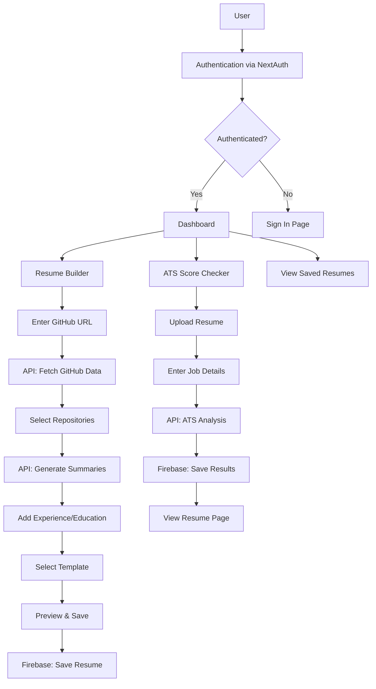

# Portfolio Generator - Project Understanding

## 📋 Project Overview

**Portfolio Generator** is a modern, feature-rich portfolio and resume builder application built with **Next.js 14**, **React 18**, and **TypeScript**. It helps developers create professional portfolios by integrating with GitHub and providing AI-powered resume analysis.

---

## 🏗️ Tech Stack

| Category | Technology |
|----------|------------|
| **Frontend** | Next.js 14, React 18, TypeScript |
| **Styling** | Tailwind CSS, shadcn/ui, Radix UI |
| **Authentication** | NextAuth.js (GitHub OAuth) |
| **Database** | Firebase Realtime Database |
| **Storage** | Firebase Storage |
| **AI/ML** | Google Generative AI (Genkit) |
| **Forms** | React Hook Form, Zod validation |
| **State Management** | React Hooks |
| **Deployment** | Vercel |

---

## 📁 Project Structure

```
portfolio-generator/
├── app/                    # App Router pages
│   ├── api/                # API routes
│   │   ├── ats-score/      # ATS score analysis endpoint
│   │   ├── auth/           # NextAuth authentication
│   │   ├── github/         # GitHub API integration
│   │   ├── pdf-to-image/   # PDF processing
│   │   ├── resume/         # Resume CRUD operations
│   │   ├── summarize/      # AI summary generation
│   │   ├── test-db/        # Database testing
│   │   └── user/           # User management
│   ├── atsScore/           # ATS score checker page
│   ├── auth/               # Authentication pages
│   ├── builder/            # Resume/portfolio builder
│   ├── contact/            # Contact page
│   ├── dashboard/          # User dashboard
│   ├── github-profile/     # GitHub profile display
│   ├── profile/            # User profile page
│   ├── resumes/            # Resume viewing pages
│   └── template/           # Resume templates gallery
├── components/             # Reusable UI components
│   ├── sections/           # Landing page sections
│   ├── ui/                 # shadcn/ui components (57 files)
│   └── auth/               # Authentication components
├── hooks/                  # Custom React hooks
├── lib/                    # Utilities and configurations
├── templates/              # 7 Resume templates
├── types/                  # TypeScript type definitions
└── styles/                 # Global styles
```

---

## 🔧 Core Functionalities

### 1. **Resume Builder** (`app/builder/page.tsx`)

A multi-step wizard that guides users through creating a portfolio:

| Step | Title | Description |
|------|-------|-------------|
| 1 | **GitHub** | Enter GitHub profile URL to fetch user data and repositories |
| 2 | **Repositories** | Select up to 3 repositories to showcase with AI-generated summaries |
| 3 | **Experience** | Add work experience with job title, company, dates, responsibilities, and technologies |
| 4 | **Education** | Add educational background (institution, degree, field, year, GPA) |
| 5 | **Template** | Choose from 4 templates: Modern, Creative, Corporate, Developer |
| 6 | **Review** | Preview and finalize the portfolio |

**Key Features:**
- Real-time preview with fullscreen edit/preview modes
- Auto-save functionality for authenticated users
- Resume manager for loading/saving multiple resumes
- GitHub profile and repository integration
- AI-powered repository summaries

---

### 2. **ATS Score Checker** (`app/atsScore/page.tsx`)

Analyzes resumes for Applicant Tracking System (ATS) compatibility:

**Process Flow:**
1. User inputs company name and job title
2. User pastes job description (max 5000 characters)
3. User uploads resume (PDF, DOCX, or TXT)
4. System generates ATS analysis using Google AI
5. Results include overall score and improvement suggestions
6. Resume and analysis are saved to Firebase

**Features:**
- Resume upload and selection from saved resumes
- Cover letter generation capability
- Resume preview images stored in Firebase Storage
- Historical resume tracking with ATS scores

---

### 3. **Dashboard** (`app/dashboard/page.tsx`)

Central hub for managing resumes:

**Features:**
- View all saved resumes with statistics
- Quick stats: Total resumes, experience entries, education entries, projects
- Resume cards showing experience/education/project counts
- Quick actions: Edit, View, Delete
- Create new resume button
- Database connection testing

---

### 4. **GitHub Integration** (`app/api/github/`)

Fetches user data from GitHub:
- Profile information (name, bio, avatar, location, stats)
- Public repositories with metadata (language, stars, forks, description)
- Repository selection for portfolio

---

### 5. **AI-Powered Features** (`lib/actions.ts`)

**ATS Results Generation:**
- Uses Google Generative AI (Genkit)
- Analyzes resume content against job description
- Generates compatibility score and recommendations

**Cover Letter Generation:**
- Creates tailored cover letters based on resume and job details
- Personalized for specific company and position

---

### 6. **Resume Templates** (`templates/`)

Seven professional templates:
1. `Template1.jsx` - Classic design
2. `Template2.jsx` - Modern layout
3. `Template3.jsx` - Creative style
4. `Template4.jsx` - Corporate format
5. `Template5.jsx` - Developer focused
6. `Template6.jsx` - Minimalist
7. `Template7.jsx` - Professional

---

## 📊 Data Flow



---

## 🔐 Authentication Flow

1. User clicks "Sign In"
2. Redirected to GitHub OAuth
3. GitHub authenticates and returns user data
4. NextAuth creates session with user ID
5. User ID used for Firebase operations
6. Session maintained across app

---

## 💾 Database Structure (Firebase Realtime Database)

```json
{
  "users": {
    "<userId>": {
      "email": "string",
      "name": "string",
      "createdAt": "timestamp"
    }
  },
  "resumes": {
    "<userId>": {
      "<resumeId>": {
        "title": "string",
        "githubUrl": "string",
        "githubId": "string",
        "selectedRepos": ["repo1", "repo2", "repo3"],
        "experience": [
          {
            "id": "string",
            "title": "string",
            "company": "string",
            "start": "string",
            "end": "string",
            "bullets": ["string"],
            "tech": "string"
          }
        ],
        "education": [
          {
            "id": "string",
            "institution": "string",
            "degree": "string",
            "field": "string",
            "year": "string",
            "gpa": "string"
          }
        ],
        "template": "modern|creative|corporate|developer",
        "colorScheme": "string",
        "githubProfile": {},
        "repos": [],
        "summaries": {},
        "analysisResult": "string",
        "createdAt": "timestamp",
        "updatedAt": "timestamp"
      }
    }
  }
}
```

---

## 🔌 API Endpoints

| Endpoint | Method | Description |
|----------|--------|-------------|
| `/api/auth/[...nextauth]` | - | NextAuth authentication handlers |
| `/api/github` | POST | Fetch GitHub profile and repositories |
| `/api/summarize` | POST | Generate AI summaries for repositories |
| `/api/ats-score` | POST | Analyze resume for ATS compatibility |
| `/api/resume` | CRUD | Resume management operations |
| `/api/user` | CRUD | User management operations |
| `/api/pdf-to-image` | POST | Convert PDF to image for preview |
| `/api/test-db` | GET | Test database connection |

---

## 🎣 Custom Hooks

### `useResumeData` (`hooks/use-resume-data.ts`)
Manages resume data with Firebase integration:
- `createResume()` - Create new resume
- `loadResume(id)` - Load specific resume
- `updateResume(id, data)` - Update resume
- `deleteResume(id)` - Delete resume
- `resumes` - Array of all user resumes
- Real-time subscription to resume changes

### `useToast` (`hooks/use-toast.ts`)
Toast notification management

### `useMobile` (`hooks/use-mobile.ts`)
Mobile detection hook

---

## 🛠️ Firebase Utilities (`lib/firebase-utils.ts`)

| Function | Description |
|----------|-------------|
| `createUser()` | Create new user record |
| `getUser()` | Retrieve user data |
| `updateUser()` | Update user information |
| `deleteUser()` | Remove user |
| `createResume()` | Save new resume |
| `getResumes()` | Get all resumes for user |
| `getResume()` | Get specific resume |
| `updateResume()` | Update resume data |
| `deleteResume()` | Delete resume |
| `subscribeToResumes()` | Real-time resume updates |
| `fetchGitHubProfileName()` | Get GitHub username from resume |

---

## 🎨 UI Components

### Landing Page Sections (`components/sections/`)
- `hero.tsx` - Hero section
- `features.tsx` - Feature highlights
- `how-it-works.tsx` - Process explanation
- `templates-showcase.tsx` - Template gallery
- `testimonials.tsx` - User testimonials
- `cta-section.tsx` - Call to action
- `footer.tsx` - Footer

### Core Components
- `ResumeManager.tsx` - Resume CRUD interface
- `AutoSave.tsx` - Auto-save functionality
- `TemplateGallery.jsx` - Template selection
- `ResumeCard.tsx` - Resume display card
- `navigation.tsx` - App navigation
- `user-profile.tsx` - User profile display

---

## 🚀 Application Flow Summary

1. **Landing Page** → User visits homepage with features overview
2. **Authentication** → User signs in via GitHub OAuth
3. **Dashboard** → View/manage existing resumes or create new
4. **Builder Flow**:
   - Fetch GitHub data
   - Select repositories (AI generates summaries)
   - Add work experience
   - Add education
   - Choose template
   - Review and save
5. **ATS Check** → Upload resume for AI-powered analysis
6. **View/Export** → Access saved portfolios and resumes

---

## 📝 Key Environment Variables

```env
# Firebase
NEXT_PUBLIC_FIREBASE_API_KEY=
NEXT_PUBLIC_FIREBASE_AUTH_DOMAIN=
NEXT_PUBLIC_FIREBASE_PROJECT_ID=
NEXT_PUBLIC_FIREBASE_STORAGE_BUCKET=
NEXT_PUBLIC_FIREBASE_MESSAGING_SENDER_ID=
NEXT_PUBLIC_FIREBASE_APP_ID=
NEXT_PUBLIC_FIREBASE_DATABASE_URL=

# NextAuth
NEXTAUTH_SECRET=
NEXTAUTH_URL=

# GitHub OAuth
GITHUB_ID=
GITHUB_SECRET=
```

---

## 👥 Team

Created by **Shubh, Urjit, and Vedant**

---

*Last Updated: December 2024*
